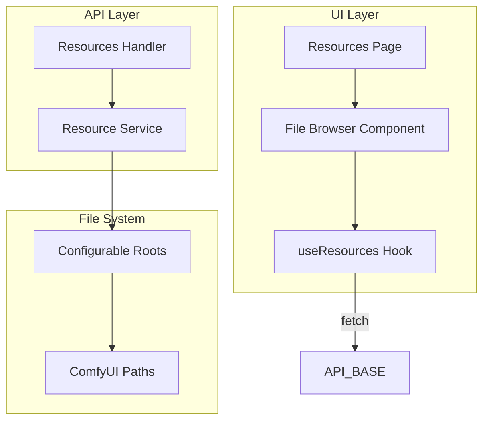

# File System Resource Manager

## Architecture

## 1. Configuration

**Root paths** — configurable via environment variables or a config file. Bench will only allow operations within these roots (path traversal prevention).

| Env Var                | Purpose                           | Example                 |
| ---------------------- | --------------------------------- | ----------------------- |
| `BENCH_RESOURCES_ROOT` | Default root for general browsing | `/home/user/bench-data` |
| `COMFYUI_PATH`         | ComfyUI install path (optional)   | `/home/user/ComfyUI`    |

**ComfyUI shortcuts** — when `COMFYUI_PATH` is set, expose named shortcuts:

- `workflows` → `{COMFYUI_PATH}/workflows`
- `models` → `{COMFYUI_PATH}/models`
- `output` → `{COMFYUI_PATH}/output`

These appear as quick-access roots in the UI alongside the general root.

## 2. API Design

**Base path:** `/api/resources`

| Method | Path                                                 | Purpose                                              |
| ------ | ---------------------------------------------------- | ---------------------------------------------------- |
| GET    | `/api/resources?root={name}&path={relPath}`          | List directory contents (JSON)                       |
| GET    | `/api/resources/download?root={name}&path={relPath}` | Download file (stream)                               |
| POST   | `/api/resources?root={name}&path={relPath}`          | Upload file (multipart) or create folder (JSON body) |
| PATCH  | `/api/resources`                                     | Rename (JSON: root, path, newName)                   |
| DELETE | `/api/resources?root={name}&path={relPath}`          | Delete file or folder                                |

**Response shapes:**

- List: `{ entries: [{ name, path, isDir, size?, mtime? }], roots: [{ id, label }] }`
- Roots endpoint: `GET /api/resources/roots` → `{ roots: [{ id, label }] }` for sidebar/selector

**Security:**

- Resolve all paths to absolute, ensure they stay under the configured root
- Reject `..` and symlinks that escape the root
- Upload size limit (e.g. 500MB default, configurable)

## 3. API Implementation (Go)

**New packages** (per [golang.mdc](.cursor/rules/golang.mdc)):

- `api/internal/config` — load roots from env/config
- `api/internal/model` — `ResourceEntry`, `Root`, request/response structs
- `api/internal/service/resource` — `List`, `Download`, `Upload`, `CreateDir`, `Rename`, `Delete`; path validation and sandboxing
- `api/internal/handler/resource.go` — HTTP handlers wiring service to responses

**Key files:**

- [api/internal/config/config.go](api/internal/config/config.go) — `Roots() []Root`, env parsing
- [api/internal/service/resource/service.go](api/internal/service/resource/service.go) — business logic, `filepath.Clean` + prefix check for traversal prevention
- [api/internal/handler/resource.go](api/internal/handler/resource.go) — handlers, multipart parsing for upload

**Route registration** in [api/internal/handler/routes.go](api/internal/handler/routes.go).

## 4. UI Implementation (React)

**New components and hooks:**

- `pages/resources-page.tsx` — main page with root selector + file browser
- `components/file-browser.tsx` — table/list of entries, breadcrumbs, action buttons
- `hooks/use-resources.ts` — TanStack Query for list, mutations for upload/rename/delete/createDir
- `services/api.ts` — extend with `fetchResourceList`, `fetchRoots`, `uploadFile`, `downloadFile`, `renameResource`, `deleteResource`, `createFolder`

**UI behavior:**

- Root dropdown/selector at top (general root + ComfyUI shortcuts when available)
- Breadcrumb navigation for current path
- Table: name, type (file/folder), size, modified time; click folder to navigate
- Actions: Upload, New folder, Rename, Delete, Download (context menu or row actions)
- Confirm dialogs for delete and overwrite on upload

**Routing:** Add "Resources" to [sidebar-left.tsx](ui/src/components/sidebar-left.tsx) nav items; use `#resources` hash. In [App.tsx](ui/src/App.tsx), conditionally render `ResourcesPage` when `window.location.hash === '#resources'` (or add a simple hash-based router).

## 5. Data Flow

1. **List:** User selects root and path → `GET /api/resources?root=...&path=...` → service resolves to absolute path, validates, reads `os.ReadDir` → returns entries
2. **Download:** `GET /api/resources/download?root=...&path=...` → service validates, streams file with `Content-Disposition: attachment`
3. **Upload:** `POST` multipart → service validates path, writes file
4. **Create folder:** `POST` with `{"action":"mkdir","name":"..."}` → `os.MkdirAll`
5. **Rename:** `PATCH` with `{"root","path","newName"}` → `os.Rename`
6. **Delete:** `DELETE` → `os.Remove` or `os.RemoveAll` for directories

## 6. Implementation Order

1. Config + model + service (path resolution, list only)
2. API handlers (list + roots + download)
3. UI: resources page, file browser (list + navigate + download)
4. API: upload, createDir, rename, delete
5. UI: action buttons, dialogs, mutations
6. Tests: service path validation, handler tests

## 7. Edge Cases

- Empty roots: if no `BENCH_RESOURCES_ROOT`, disable or hide Resources until configured
- Large directories: paginate or limit entries (e.g. 1000) to avoid timeouts
- Special files: skip or hide `.` and `..`; optionally hide dotfiles via query param

