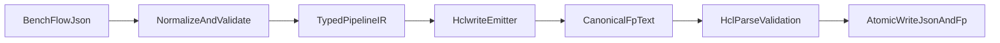

# Refactor Flow HCL Generation (JSON -> Flowpipe HCL)

## Current State and Constraints

- Bench currently stores flows as JSON and generates `.fp` by string concatenation in [/home/master/src/bench/api/internal/service/flow/service.go](/home/master/src/bench/api/internal/service/flow/service.go).
- Flowpipe mod discovery is `.fp`-based (not generic `.json` mod files), per Flowpipe app config and docs.
- Conclusion: **JSON can absolutely be converted to valid Flowpipe HCL** (you already do this), but for runtime compatibility we should continue emitting `.fp` files rather than treating JSON as first-class Flowpipe mod resources.

## Generation Strategy Options

### Option A: Keep string-builder approach, improve hygiene

- Add centralized escaping/util helpers, deterministic map iteration, and stricter config validation.
- Pros: smallest change, fast delivery.
- Cons: still brittle over time; harder to extend with new step types/blocks.

### Option B: Emit HCL-JSON format directly from Bench JSON

- Convert Bench model to HCL JSON syntax and rely on HCL JSON parsing.
- Pros: aligns naturally with JSON data structures.
- Cons: Flowpipe mod loading is `.fp`-centric; this likely introduces loader/discovery divergence and operational risk.

### Option C (Recommended): Typed intermediate model + `hclwrite` emitter

- Keep Bench JSON as source-of-truth; build a typed internal pipeline model; generate canonical `.fp` via HCL AST writing.
- Pros: safer quoting/formatting, deterministic output, easier extension, better long-term maintenance.
- Cons: moderate refactor and dependency additions.

## Recommended Target Architecture

## Refactor Plan (Phased)

### Phase 1: Stabilize contracts before emitter rewrite

- Introduce a typed validation/normalization layer for `FlowStep.Config` in [/home/master/src/bench/api/internal/model/flow.go](/home/master/src/bench/api/internal/model/flow.go) and flow service boundary in [/home/master/src/bench/api/internal/service/flow/service.go](/home/master/src/bench/api/internal/service/flow/service.go).
- Explicitly model expression-vs-literal fields (e.g., `if`, `for_each`, `value`, step refs) so quoting rules are deterministic.
- Add deterministic ordering for map-based outputs (`env`, pipeline args, common attributes) to avoid noisy diffs.

### Phase 2: Extract generation into dedicated package

- Move generation responsibilities from monolithic service methods into `api/internal/service/flow/hclgen` package (new).
- Create:
  - `Builder` (IR -> HCL doc)
  - step emitter registry (`http`, `query`, `message`, `sleep`, `transform`, `container`, `pipeline`)
  - shared common-attributes emitter
- Keep `Service.Save*` orchestration in place, but call new generator package.

### Phase 3: Replace string concatenation with AST-based emission

- Adopt HashiCorp HCL libraries (`hclwrite`, `cty`) in API module.
- Emit canonical `.fp` blocks via AST construction, not `fmt.Sprintf` chains.
- Preserve existing Flowpipe semantics and naming (`pipeline`, `step`, `param`, `output`, `depends_on`, common blocks).

### Phase 4: Add parse/compat validation gates

- Add a syntax validation pass (`hclparse`) for generated content before write.
- Optionally add a Flowpipe smoke parse/run check in CI/dev script for representative fixtures.
- Fail save on invalid generated HCL with actionable error context (step id/type/field).

### Phase 5: Hardening and forward compatibility

- Write files atomically (`.tmp` + rename) to avoid partial writes.
- Make root and module save paths consistent (same write-order and failure behavior).
- Introduce versioned generator contract (e.g., `generatorVersion`) to support future step-schema evolution.

## Test Strategy

- Convert current containment checks in [/home/master/src/bench/api/internal/service/flow/flow_test.go](/home/master/src/bench/api/internal/service/flow/flow_test.go) into golden tests for fixtures in [/home/master/src/bench/workspace/flows/tests](/home/master/src/bench/workspace/flows/tests).
- Add table-driven cases for expression handling and escaping edge cases (quotes, backslashes, interpolation, heredoc-like multiline).
- Add round-trip structural tests:
  - Bench JSON -> generated HCL -> parse AST -> assert required blocks/attrs exist.
- Add regression fixtures for `for_each`, `retry`, output blocks, `depends_on`, and mixed literal/expression args.

## Decision Record for Futureproofing

- **Canonical storage**: keep Bench JSON for editor friendliness.
- **Runtime artifact**: always emit `.fp` for Flowpipe compatibility.
- **Extensibility**: add new step types by registering emitters + config validator, not editing one giant switch.
- **Validation-first**: reject invalid config early; never write stale JSON/HCL mismatches.

## Research Sources

- Flowpipe repo overview: [https://github.com/turbot/flowpipe](https://github.com/turbot/flowpipe)
- Flowpipe docs (mods in HCL, `.fp` loading): [https://raw.githubusercontent.com/turbot/flowpipe-docs/main/docs/build/index.md](https://raw.githubusercontent.com/turbot/flowpipe-docs/main/docs/build/index.md)
- Flowpipe app-specific extensions (`.fp`, `.fpc`): [https://raw.githubusercontent.com/turbot/flowpipe/main/internal/cmdconfig/app_specific.go](https://raw.githubusercontent.com/turbot/flowpipe/main/internal/cmdconfig/app_specific.go)
- pipe-fittings parser supports HCL/JSON/YAML parsing primitives: [https://raw.githubusercontent.com/turbot/pipe-fittings/develop/parse/parser.go](https://raw.githubusercontent.com/turbot/pipe-fittings/develop/parse/parser.go)

