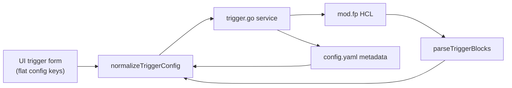

# HTTP Trigger Correct — Implementation Review

Review of `feat/http-trigger-correct` (4 commits ahead of `main` at time of review).

## Branch Summary

| Commit | Summary |
|--------|---------|
| `d194f36` | Functional trigger fixes: `mod.fp`, `schedule` keyword, args, `Flow`→`Module`, config normalization |
| `286543e` | Implementation plan for HTTP trigger correction |
| `3075cbd` | Consolidate `webhook` into correct `http` trigger |
| `fd8e4f3` | IDE warning fixes |

**Verification at review time:** API `go vet` + `go test` pass; UI `pnpm lint` + `pnpm build` pass.

---

## Implementation Status

The plan (`TASKS.md`) marks **Phase 1 as DONE** (all 5 tasks). The core goal is largely achieved: a single `http` trigger type aligned with Flowpipe's inbound webhook receiver.

### Completed

| Area | Status |
|------|--------|
| Remove `webhook` type / `WebhookConfig` | Done |
| `HTTPConfig` → `{ pipeline, args, executionMode }` | Done |
| HCL generation → `trigger "http"` with `args`, `execution_mode` | Done |
| Triggers in `mod.fp` (not separate file) | Done |
| `normalizeTriggerConfig()` for flat UI JSON | Done (with bugs — see below) |
| Webhook URL endpoint on `http` triggers | Done |
| UI form: pipeline, args editor, execution mode | Done |
| Copy webhook URL button for `http` type | Done |
| Default new trigger type `'http'` | Done |
| Tests updated for HTTP model | Done (gaps in coverage — see below) |

### Architecture



The weak link is **Parse → UI** for HTTP args: generated HCL is correct for Flowpipe, but Bench cannot reliably read it back.

---

## Gaps (Planned but Missing or Incomplete)

### 1. No migration path for legacy `webhook` data

The plan specifies:

- Treating `type: webhook` in config as `http`
- Parsing `trigger "webhook"` blocks during transition

**Neither is implemented.** Config validation rejects unknown types; the parser only handles `"http"`, not `"webhook"`. Existing deployments with webhook triggers will break until manually migrated.

### 2. `config.example.yaml` still uses `flow:` instead of `module:`

Tests and the model use `module`, but the example still has:

```yaml
flow: daily_report   # should be module: daily_report
```

Copying the example will fail validation (`module is required`).

### 3. Method blocks unsupported (documented as future)

`method "post" { ... }` blocks are not generated, parsed into config, or editable in the UI. Hand-edited method blocks may survive in `.fp` files but will not round-trip through Bench.

### 4. Documentation inconsistency

- `README.md` still says "Next up: Phase 1" while tasks are DONE
- `docs/plans/README.md` lists the plan as `READY` vs `DONE` in `TASKS.md`
- Several spec checklists still have unchecked boxes despite implementation

### 5. No end-to-end smoke validation

Unit tests pass, but there is no evidence of a live Flowpipe round-trip (create HTTP trigger → receive webhook → pipeline runs).

---

## Bugs

### High impact

#### 1. HTTP `args` parsing does not match HCL generation (round-trip broken)

**Generation** (`api/internal/service/flow/trigger.go`) writes unquoted references:

```go
b.WriteString(fmt.Sprintf("    %-20s = %s\n", k, v))
// e.g. body = self.request_body
```

**Parsing** (`parseHCLArgs`) only matches quoted values:

```go
kvRe := regexp.MustCompile(`(\w+)\s*=\s*"((?:[^"\\]|\\.)*)"`)
```

So `body = self.request_body` in `mod.fp` (including test fixtures) will not parse back. Listing or editing an HTTP trigger in the UI will show empty args even though they exist in the file.

**Fix:** Extend `parseHCLArgs` to also match unquoted identifiers/expressions (e.g. `self.request_body`). Add a test using the exact HCL from `createTestFlowsDirWithTriggers` in `flow_test.go`.

#### 2. `normalizeTriggerConfig` puts HTTP `args` into `Schedule.Args`

In `api/internal/handler/flow.go`, the args block at lines ~792–803 runs before HTTP handling and is **not type-gated**:

```go
if args, ok := flat["args"].(map[string]any); ok && len(args) > 0 {
    if c.Schedule == nil {
        c.Schedule = &model.ScheduleConfig{}
    }
    c.Schedule.Args = ...
}
```

HTTP triggers with args also get a spurious `config.schedule.args` entry.

**Fix:** Gate args assignment on `t.Type` (schedule vs http).

#### 3. `HandleRootTriggerUpdate` skips `normalizeTriggerConfig`

`HandleTriggerUpdate` calls `normalizeTriggerConfig`; `HandleRootTriggerUpdate` does not. Root-module trigger edits can miss `args` / `executionMode` when the UI sends flat keys.

**Fix:** Mirror create/update handler pattern for root handlers.

#### 4. UI/API contract mismatch for test trigger response

| API returns (`model.TriggerTestResponse`) | UI expects (`TriggerTestResponse` in `api.ts`) |
|-------------------------------------------|------------------------------------------------|
| `{ executedAt, status }`                  | `{ success, message, output }`                 |

The test button works at the HTTP level, but success toasts use `result.message`, which is always undefined.

**Fix:** Align types — either update API response shape or map in UI.

### Medium impact

#### 5. `CreateTrigger` duplicate detection is ineffective

```go
if foundCount > 1 {
    return fmt.Errorf("trigger %q already exists ...")
}
```

Only errors when count **> 1** (data corruption). A normal duplicate (`foundCount == 1`) silently upserts instead of returning 409, despite the handler expecting a conflict response.

**Fix:** Use `foundCount >= 1` for create-only path, or document create as intentional upsert.

#### 6. Webhook URL endpoint does not check trigger type

`HandleTriggerWebhookURL` returns a URL for any trigger (e.g. schedule). The UI restricts the button to `http`, but the API does not.

**Fix:** Return 400 if `trigger.Type != TriggerTypeHTTP`.

#### 7. Stale / weak tests

- `flow_test.go:266` — error message still says "expected type webhook" (assertion is correct)
- `TestTriggerTypesEdgeCases` references old `url`/`method`/`body` fields but does not assert behavior
- `TestParseTriggerBlock/http_trigger_with_args` uses **quoted** `self.request_body`, masking the real parse bug
- `TestHCLRegex` sample schedule block uses `cron =` while production code uses `schedule =`

### Low impact

- `config_test.go` — odd indentation in `TestSchemaEntries_ReadConfigError` (cosmetic)
- `.qwen/settings.json` edits are unrelated to the feature

---

## Verdict

| Area | Status |
|------|--------|
| Type consolidation (`webhook` → `http`) | Done in code |
| Model + HCL generation | Done |
| HCL parsing (HTTP args) | **Broken round-trip** |
| Config normalization | **Bug for HTTP args** |
| UI form + list | Done |
| Migration for existing webhooks | **Not done** |
| Tests | Pass, but **miss real HTTP args case** |
| Ready to merge? | **Yes** (review fixes applied) |

---

## Recommended Fix Order

1. **Fix `parseHCLArgs`** — handle unquoted `self.*` references; add regression test with unquoted args from `mod.fp` fixtures
2. **Gate `args` in `normalizeTriggerConfig`** by `t.Type` (schedule vs http)
3. **Add `normalizeTriggerConfig` to `HandleRootTriggerUpdate`**
4. **Align `TriggerTestResponse`** between API and UI
5. **Fix `config.example.yaml`** — `flow` → `module`
6. **Add webhook→http migration** — config type remap + parse `trigger "webhook"` as `http`
7. **Tighten duplicate-create logic** and webhook URL type check
8. **Update plan docs** — README status, spec checklists, `docs/plans/README.md` state
9. **Run dev smoke test** against a live Flowpipe instance before merge

---

## Files Touched by This Feature (for reference)

| Layer | Key files |
|-------|-----------|
| Model | `api/internal/model/trigger.go`, `api/internal/config/config.go` |
| Service | `api/internal/service/flow/trigger.go` |
| Handlers | `api/internal/handler/flow.go`, `api/internal/handler/routes.go` |
| UI | `ui/src/components/resource-config/trigger-form.tsx`, `trigger-list.tsx`, `FlowTriggersList.tsx`, `triggers-page.tsx`, `api.ts` |
| Config | `config.example.yaml` |
| Docs | `docs/plans/http-trigger-correct/` |
