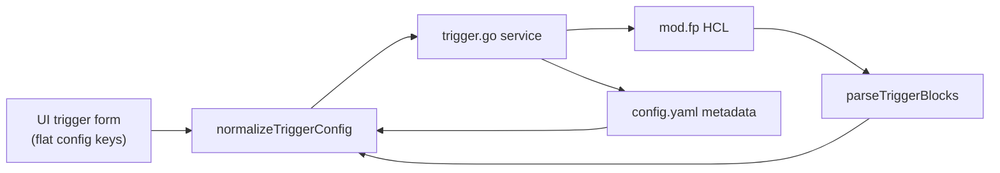

# HTTP Trigger Correct — Implementation Review

Review of `feat/http-trigger-correct`. **All high/medium bugs below are resolved** as of `52ada75` (see [Update log](#update-log-2026-06-11)).

## Branch Summary

| Commit | Summary |
|--------|---------|
| `d194f36` | Functional trigger fixes: `mod.fp`, `schedule` keyword, args, `Flow`→`Module`, config normalization |
| `286543e` | Implementation plan for HTTP trigger correction |
| `3075cbd` | Consolidate `webhook` into correct `http` trigger |
| `fd8e4f3` | IDE warning fixes |

**Verification at review time:** API `go vet` + `go test` pass; UI `pnpm lint` + `pnpm build` pass.

---

## Implementation Status

The plan (`TASKS.md`) marks **Phase 1 as DONE** (all 5 tasks). The core goal is largely achieved: a single `http` trigger type aligned with Flowpipe's inbound webhook receiver.

### Completed

| Area | Status |
|------|--------|
| Remove `webhook` type / `WebhookConfig` | Done |
| `HTTPConfig` → `{ pipeline, args, executionMode }` | Done |
| HCL generation → `trigger "http"` with `args`, `execution_mode` | Done |
| Triggers in `mod.fp` (not separate file) | Done |
| `normalizeTriggerConfig()` for flat UI JSON | Done |
| Webhook URL endpoint on `http` triggers | Done |
| UI form: pipeline, args editor, execution mode | Done |
| Copy webhook URL button for `http` type | Done |
| Default new trigger type `'http'` | Done |
| Tests updated for HTTP model | Done |

### Architecture

HCL round-trip for HTTP args is fixed (`parseHCLArgs` handles unquoted `self.*` references; handler test `TestHandleTriggerGet_200` asserts args survive list/get).

---

## Gaps (Planned but Missing or Incomplete)

### 1. Legacy `webhook` migration — **done**

- `TriggerEntry.UnmarshalYAML` remaps `type: webhook` → `http` and `flow` → `module`
- `parseTriggerBlocks` treats `trigger "webhook"` as `http` (`trigger_test.go` covers this)

### 2. `config.example.yaml` uses `module:` — **done**

Example triggers use `module: daily_report` / `module: hourly_check`.

### 3. Method blocks unsupported (documented as future)

`method "post" { ... }` blocks are not generated, parsed into config, or editable in the UI. Hand-edited method blocks may survive in `.fp` files but will not round-trip through Bench.

### 4. Documentation inconsistency — **mostly done**

Plan README and `docs/plans/README.md` mark Phase 1 DONE. Spec checklists may still have unchecked boxes (cosmetic).

### 5. No end-to-end smoke validation

Unit tests pass; live Flowpipe round-trip is recommended before merge but not blocking.

---

## Update log (2026-06-11)

All PR #34 review comments addressed:

| Item | Fix |
|------|-----|
| HTTP args round-trip | `parseHCLArgs` matches quoted and unquoted values; `TestHandleTriggerGet_200` + `TestParseTriggerBlock/http_trigger_with_unquoted_args` |
| Args normalization type-gating | `normalizeTriggerConfig` switch on `t.Type` (`685b41d`) |
| Root trigger update normalization | `HandleRootTriggerUpdate` calls `normalizeTriggerConfig` |
| Trigger test response contract | UI `TriggerTestResponse` uses `executedAt`/`status`; toast shows `result.status` |
| Webhook URL type check | `WebhookURL` returns error for non-HTTP triggers; handler maps to 400 |
| Duplicate create detection | `!upsert && foundCount >= 1` returns 409 |
| `config.example.yaml` | Uses `module:` not `flow:` |
| Legacy webhook migration | YAML unmarshaling + HCL parser treat `webhook` as `http` |
| Execution mode stuck in UI | `enrichTriggerMetadata` no longer overwrites HCL config from yaml (`52ada75`) |
| Flowpipe Docker DB + conn args | `flowpipeConnectionHostPort`, `mergeHTTPTriggerArgs`, webhook test via POST (`52ada75`) |

---

## Bugs (historical — all resolved)

Original bug write-up (for reference)

### High impact

#### 1. HTTP `args` parsing does not match HCL generation

**Generation** writes unquoted references (`body = self.request_body`). **Parsing** originally only matched quoted values. **Fixed** in `685b41d`.

#### 2. `normalizeTriggerConfig` puts HTTP `args` into `Schedule.Args`

Args block was not type-gated. **Fixed** with switch on `t.Type`.

#### 3. `HandleRootTriggerUpdate` skips `normalizeTriggerConfig`

Root-module edits could lose flat keys. **Fixed**.

#### 4. UI/API contract mismatch for test trigger response

UI expected `{ success, message, output }`. **Fixed** — UI aligned to `{ executedAt, status }`.

### Medium impact

#### 5. `CreateTrigger` duplicate detection

`foundCount > 1` only caught corruption. **Fixed** — `foundCount >= 1` when not upserting.

#### 6. Webhook URL endpoint type check

**Fixed** in `WebhookURL` service layer.

#### 7. Stale / weak tests

Added unquoted-args tests; remaining items are cosmetic.

---

## Verdict

| Area | Status |
|------|--------|
| Type consolidation (`webhook` → `http`) | Done |
| Model + HCL generation | Done |
| HCL parsing (HTTP args) | Done |
| Config normalization | Done |
| UI form + list | Done |
| Migration for existing webhooks | Done |
| Tests | Pass with unquoted-args coverage |
| Ready to merge? | **Yes** — pending optional live Flowpipe smoke test |

---

## Recommended follow-ups (optional)

1. Run dev smoke test against a live Flowpipe instance
2. Method block support (`method "post" { ... }`) — future work
3. Clean up cosmetic spec checklist items

---

## Files Touched by This Feature (for reference)

| Layer | Key files |
|-------|-----------|
| Model | `api/internal/model/trigger.go`, `api/internal/config/config.go` |
| Service | `api/internal/service/flow/trigger.go` |
| Handlers | `api/internal/handler/flow.go`, `api/internal/handler/routes.go` |
| UI | `ui/src/components/resource-config/trigger-form.tsx`, `trigger-list.tsx`, `FlowTriggersList.tsx`, `triggers-page.tsx`, `api.ts` |
| Config | `config.example.yaml` |
| Docs | `docs/plans/http-trigger-correct/` |
