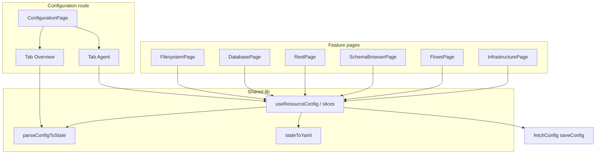

# Resource configuration UX consolidation

## Executive Summary

Bench centralizes `config.yaml` editing in a single large **Configuration** screen (`configuration-page.tsx`, component `ConfigurationPage`, formerly `resources-config-page` / `ResourcesConfigPage`) while feature areas (Filesystem, Database, REST, etc.) live on separate routes. Users must jump between **Configuration** and feature pages; empty states often say “configure on the Configuration page.”

This plan **moves resource-specific configuration onto each feature page** behind a **Browse | Settings** (or extended) tab pattern with a **non-full-width** tab list, extracts shared **parse / serialize / save** logic into a reusable module, and **slims Configuration** to **Tab 1 — Overview** (read-only snapshot + deep links) and **Tab 2 — Agent** (global agent settings). **Task 1.1** renamed modules to `filesystem-page.tsx` and `configuration-page.tsx`.

**Outcome**: One mental model—configure where you use the resource—with a safe read-modify-write pipeline so partial saves never wipe unrelated YAML. **No API contract changes**; UI continues to use `fetchConfig` / `saveConfig`.

---

## Current State

### Config and UI (today)

| Layer | Implementation |
|-------|----------------|
| **Config file** | Single YAML (`config.yaml`) with `resources.*`, `flows`, `infrastructure`, `agent` |
| **UI editor** | `[ui/src/pages/configuration-page.tsx](ui/src/pages/configuration-page.tsx)` (~2.2k lines), tabs for filesystem, schemas, databases, REST, flows (+ workspaces), infrastructure, agent |
| **Feature pages** | `[ui/src/pages/filesystem-page.tsx](ui/src/pages/filesystem-page.tsx)` exports `FilesystemPage`; REST, Database, Schemas, Flows, Infrastructure each have dedicated pages |
| **Routes** | Hash routes in `[ui/src/App.tsx](ui/src/App.tsx)`; sidebar in `[ui/src/components/sidebar-left.tsx](ui/src/components/sidebar-left.tsx)` |
| **Persistence** | `saveConfig(content: string)` replaces full file; client must merge slices |

### Module names (task 1.1)

| File | Role |
|------|------|
| `filesystem-page.tsx` | **Filesystem** browsing only (`FilesystemPage`) |
| `configuration-page.tsx` | **Configuration** route (`ConfigurationPage`) |

### Limitations

1. **Split attention**: Edit connections on Configuration, use features elsewhere.
2. **Monolith**: Hard to reuse forms; high merge conflict risk.
3. **Empty states** push users to Configuration instead of inline onboarding.

---

## Goals

1. **Per-resource settings** on each feature page (filesystem, database, REST, schemas, flows + workspaces, infrastructure) via **tabs** (work first, settings second).
2. **Compact tab chrome**: `TabsList` content-sized and start-aligned — not full viewport width.
3. **Shared config module**: Types, `parseConfigToState`, `stateToYaml`, and a **read-modify-write** hook so slice updates never drop other sections.
4. **Configuration page**: **Overview** (audit + links) + **Agent** only; remove duplicate full resource editors.
5. **Rename** page modules for clarity (`filesystem-page`, `configuration-page`).
6. **Copy and empty states** updated so resource setup points to local Settings where appropriate; agent errors still reference Configuration.

---

## Architecture

### Per-page vs global

| Config area | YAML | Home |
|-------------|------|------|
| Filesystem roots | `resources.filesystem[]` | Filesystem page |
| Databases | `resources.databases[]` | Database page |
| REST | `resources.rest[]` | REST page |
| Schemas | `resources.schemas[]` | Schema browser page |
| Flows path + workspaces | `flows.path`, `flows.workspaces[]` | Flows page |
| Infrastructure path | `infrastructure.path` | Infrastructure page |
| Agent | `agent.*` | Configuration → Agent tab |

**REST ↔ schemas**: REST may reference `schemaId`; Settings on REST should include a schema picker + link to `#schemas`.

### Data model (TypeScript)

Reuse and relocate types from today’s `ResourceFormState`: `FilesystemResource`, `DatabaseResource`, `RestResource`, `SchemaResourceEntry`, `FlowsConfig`, `WorkspaceResource`, `InfrastructureConfig`, `AgentConfig`, etc. (exact names preserved from current implementation during extraction).

### API

- **Unchanged**: `GET`/`PUT` config as raw YAML string via existing `[ui/src/services/api.ts](ui/src/services/api.ts)` functions.
- **Backend**: No new endpoints required for this plan.

---

## Implementation Phases

| Phase | Focus | Deliverable |
|-------|--------|-------------|
| **1** | Rename + config lib + hook | `filesystem-page` / `configuration-page`, `ui/src/lib/resource-config/` (or `features/`), RMW hook |
| **2** | Presentational editors | Reusable settings components extracted from former monolith |
| **3** | Feature integration | Each page: work vs Settings tabs + wired saves |
| **4** | Configuration page | Overview + Agent tabs only |
| **5** | Polish | Copy, `NotConfiguredCard`, query invalidation, full verification |

Task IDs and specs: [TASKS.md](./TASKS.md).

---

## Security

- **Path validation**: Preserve existing server-side rules for config paths; UI must not weaken validation already enforced by API.
- **Secrets**: Auth fields (basic, bearer, apiKey) remain in YAML as today; no new logging of tokens.
- **No new attack surface**: Same save endpoint; client-side merge must not drop unrelated keys (mitigated by centralized RMW hook + tests).

---

## Testing Strategy

- **Unit**: Parse/serialize round-trip; merge helpers for slice updates.
- **UI**: Manual smoke per resource type after integration; agent save from Configuration.
- **Regression**: `pnpm lint`, `pnpm build`; API `go vet`, `go test`, `go build` per [AGENTS.md](../../../AGENTS.md).

---

## Migration

- **Backward compatible**: Same YAML shape; no user migration script.
- **Rollout**: Implement in phases; optional feature flags not required if tasks merge sequentially.

---

## Future Enhancements

- Hash segment for Configuration sub-tabs (e.g. `#configuration/agent`) for deep links from Agent chat.
- Further split `useResourceConfig` into per-slice hooks if bundle size or test isolation demands it.
